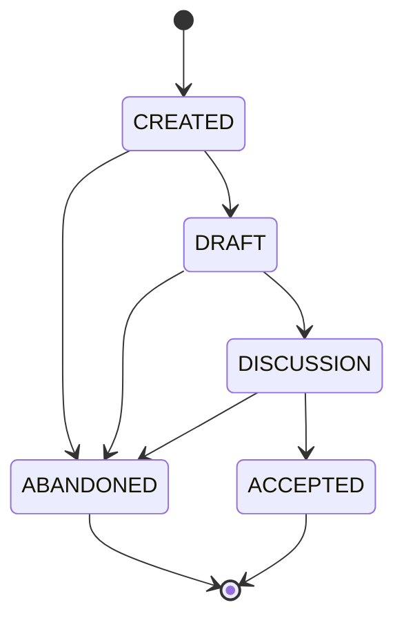

Requests for Discussion (RFDs) are intended to enable open discussions about
product enhancements, system design, and engineering practices. The goal of RFDs
is to create a mechanism that enables open engineering communication while 
simultaneously capturing decisions and considerations.

<!--truncate-->

## Overview

RFDs are written in Markdown and stored using Git. This allows them to be 
accessible to most engineers and version controlled throughout the editing 
process.

Being written in Markdown, RFDs are intended to be readable via modern Git 
platforms, GitHub being the primary platform used. All RFDs will use 
Markdown front-matter to capture certain key metadata (described below) that 
also allows RFDs to be rendered with many static site generators – Docusaurus
is the initial and primary use case for this.

## State

Triple Dot RFDs use the following states:

0. CREATED
1. DRAFT
2. DISCUSSION
3. ACCEPTED
4. ABANDONED

*CREATED* is the pseudo-state immediately after an RFD has been created. It may
never actuallt enter this state in the index and should only be in this state 
when first created by the author.

*DRAFT* indicates that the RFD is being written by the author(s). It is not yet 
open for discussion.

*DISCUSSION* indicates the RFD is open for discussion. The draft has been completed
at a discussion had been initiated.

*ACCEPTED* is when the discussion has been closed and the draft has been finalized.
At this point, the final draft has been published. The discussion 
is no longer open and the RFD has been accepted.

*ABANDONED* indicates that the RFD is no longer relevant and should be disregarded.
This can occur at any prior stage of the RFD lifecycle.

#### Additional State Considerations

*Implemented* indicates that the RFD has been accepted and changes have been
incorporated into the relevant product(s). *Implemented* is a state of the product,
not a state of the RFD.

## Workflow


> What workflow will the RFD state change follow?

Triple Dot RFDs will use Git as the primary version control mechanism. The 
diagram below shows the basics of the workflow followed by descriptions of
the process for each state transition.



#### *CREATED → DRAFT*

Allocate the RFD.

RFDs are numbered starting at 1, and should be represented as zero-padded 4-digit 
numbers. Use the `rfd.py` tool, to allocate a new RFD number and generate some 
boiler-plate content from a template. To create a new RFD, run:

```bash
python tools/rfd.py make
```

This will prompt you for some basic information to fill out the initial metadata.
Note, that GitHub username is used to identify the author. This enables us to
more easily link the author URL to the person submitting the pull request.

Then perform the following steps:

1. Create a branch called `allocate/<id>` where `<id>` is your RFD number.
1. Update the state metadata to `draft` and open a PR.
1. Open a pull request against the `main` branch. Once accepted, this will 
    allocate the RFD number and place the RFD in the `draft` state.


#### *DRAFT → DISCUSSION*

Open for discussion. First follow these steps to publish the draft:

1. Created a branch of the format `draft/<id>`.
1. Write the RFD
1. Update the state to `discussion` and set draft to `false` and open a PR.
1. This must be reviewed by at least 1 reviewer before approval.

Then, follow these steps to open the discussion:
1. Create a new branch called `rfd/<id>`.
1. Open a PR against `main`.

This PR is the place to discuss the RFD.


#### *DISCUSSION → ACCEPTED*

Discussion and acceptance.

1. Discussion should be had in the PR and the draft should be edited accordingly
1. State metadata should be set to `accepted` 
1. 
1. Once approved (process TBD), the PR will be merged and the discussion closed.

#### *\* → ABANDONED*

At any point an RFD can be declared abandoned and should be disregarded. This 
decision can be made by the RFD author(s) or the RFD maintainers.

## Metadata

> What metadata do we need to keep track of?

We will keep track of at least the following metadata in the markdown front
matter:

- title
- Author(s)
- Date
- State

Additionally, any [Docusaurus blog front matter](https://docusaurus.io/docs/api/plugins/@docusaurus/plugin-content-blog#markdown-front-matter)
should be considered valid metadata.


## Tooling

> What tooling do we need to support the above workflow?

1. `rfd make` - This will be used to create a new RFD with boilerplate content
and front matter in the appropriate directory structure aligning with this RFD.
1. `rfd index` - This should read all RFDs and their metadata to autogenerate
the RFD index.
1. `rfd validate` - This optional tool can be used to validate an RFD conforms
to expected practices.

## See Also

The following resources may provide additional context relevant to this RFD.
 
- https://github.com/joyent/rfd
- https://oxide.computer/blog/rfd-1-requests-for-discussion
